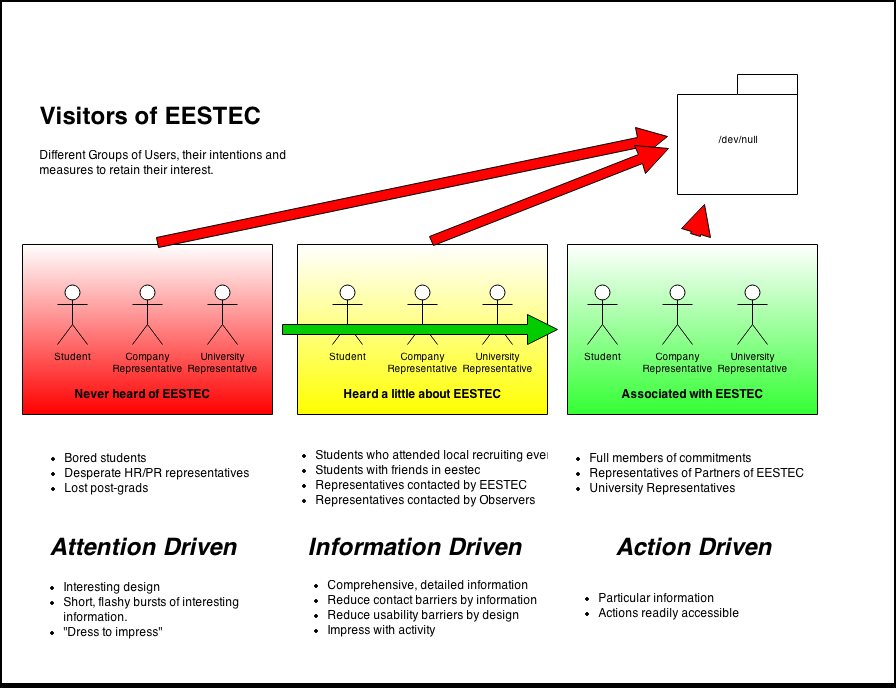

Welcome to eestec.net's documentation!
======================================

Motivation
##########

The motivation for creating this open source project is to provide an online platform for the
Electrical Engineering Students' European Association (EESTEC). Its purpose is to serve
as a central communication and administration hub for the association and preserve knowledge for
future generations.

Use cases
#########

The online platform of EESTEC will serve content to different visitors with different backgrounds and different intentions.
Visitors can be grouped according to the illustration below

The platform should identify the key target groups and adapt its presentation to minimize the fraction of key users
leaving the website (red arrows) without having become associated with EESTEC.

.. toctree::

   :maxdepth: 1
   problem
   requirements
       usecases
   interface
   implementation
   setup
   overview

Indices and tables
==================

* :ref:`genindex`
* :ref:`modindex`
* :ref:`search`

